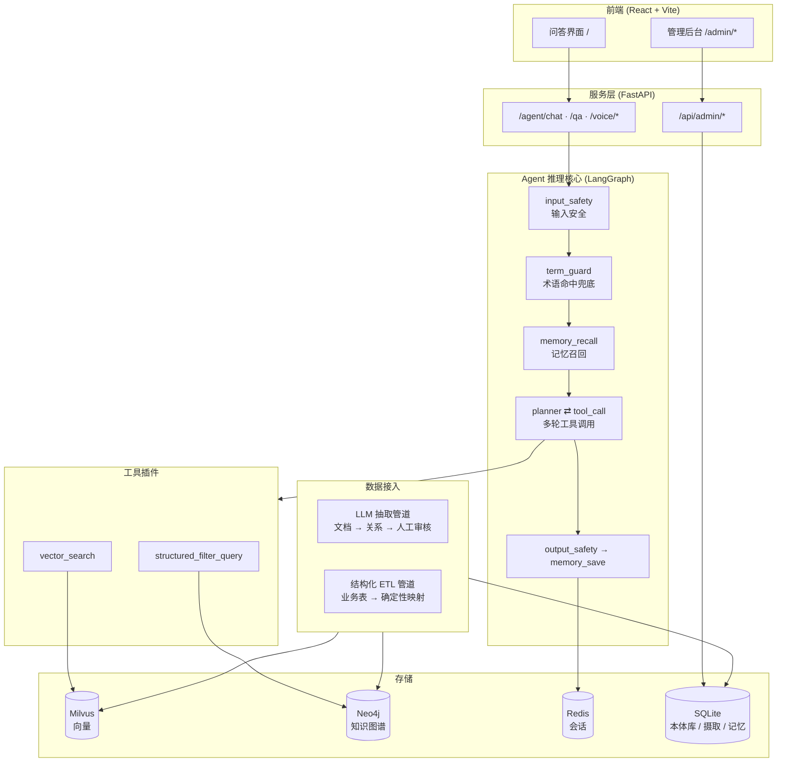
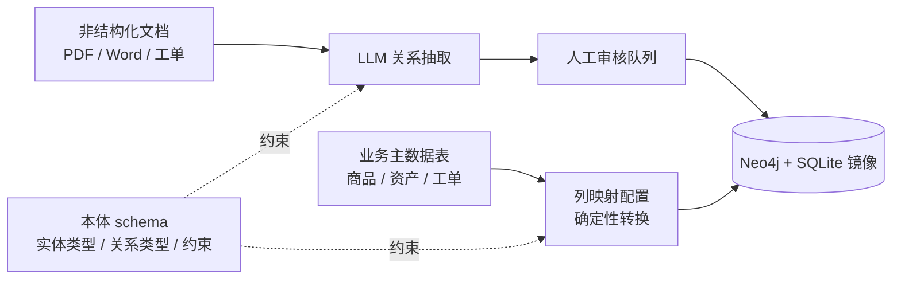

# customer_rag

面向企业产品 / SaaS 客服场景的多租户问答系统。在通用 RAG 之上加了一层知识图谱（GraphRAG），解决客服场景里最要命的那类错误——**专有名词答错**：模块名、错误码、配置参数、商品型号，这些词单靠向量检索的语义相似度很难分辨。

后端 FastAPI + LangGraph，前端 React + Vite，附带一套完整的管理后台：本体建模、数据接入、人工审核、问答诊断。

---

## 目录

- [核心能力](#核心能力)
- [架构概览](#架构概览)
- [快速开始](#快速开始)
- [管理后台](#管理后台)
- [两条知识图谱写入路径](#两条知识图谱写入路径)
- [目录结构](#目录结构)
- [开发](#开发)
- [常见问题](#常见问题)
- [文档](#文档)

---

## 核心能力

| 能力 | 说明 |
| --- | --- |
| **混合检索** | 向量 + BM25 双路召回，RRF 融合，可选接 Rerank 模型精排 |
| **GraphRAG** | 术语表命中兜底 + Neo4j 子图查询，避免 Agent 漏查图谱 |
| **Agent 编排** | LangGraph 显式状态机，安全网节点强制介入，支持 planner 模式的多轮工具调用 |
| **工具插件化** | `app/agent/tools/<name>/{manifest.yaml,tool.py}`，启动时扫描注册；manifest 损坏直接让进程启动失败，不拖到第一个请求 |
| **分层记忆** | 会话滑窗 + 摘要（短期）、结构化长期记忆（跨会话），带事实级冲突消解 |
| **多格式摄取** | PDF（含表格版面分析）/ Word / 扫描件 OCR / 图片 / 工单 CSV / Excel 宽表 |
| **多租户** | `tenant_id` 贯穿向量库、图谱、SQLite；可选网关共享密钥校验身份 |
| **语音** | 流式 ASR（WebSocket 分片）+ 专有名词校正、句子级流式 TTS |
| **内容安全** | 输入输出双向检查，PII / 敏感词 / prompt injection |

---

## 架构概览



完整设计（含分块策略、记忆子系统、主动跟进引擎、评估体系）见 [`docs/ARCHITECTURE.md`](docs/ARCHITECTURE.md)。

---

## 快速开始

### 前置条件

- **Python 3.12+**
- **Node.js 20+**（Vite 6 要求 18+，建议 20 LTS）
- **Docker Desktop**（Milvus / Neo4j / Redis 都跑在容器里）
- 一个国产云 LLM + Embedding 的 API Key（Qwen / DeepSeek / GLM / Kimi 任一家的 OpenAI 兼容端点）

### 1. 启动依赖服务

```bash
docker compose up -d etcd minio milvus neo4j redis
```

首次启动 Milvus 要等一会儿才就绪，可以用健康检查确认：

```bash
curl http://localhost:9091/healthz     # Milvus
curl http://localhost:7474             # Neo4j 浏览器
```

> `docker-compose.yml` 里还有一个 `app` 服务，那是容器化部署用的。本地开发不需要它——后端直接跑在宿主机上，改代码即时生效。

### 2. 准备 Python 环境

```bash
python -m venv .venv
.venv\Scripts\activate            # Windows
# source .venv/bin/activate       # macOS / Linux

pip install -e ".[dev]"
```

### 3. 配置环境变量

```bash
cp .env.example .env
```

`.env.example` 里每一项都带了说明，**至少要填这几项**才能跑起来：

| 变量 | 说明 |
| --- | --- |
| `CUSTOMER_RAG_LLM_API_KEY` | LLM 的 key |
| `CUSTOMER_RAG_EMBEDDING_API_KEY` | Embedding 的 key |
| `CUSTOMER_RAG_EMBEDDING_DIMENSION` | **必须和所选模型的实际输出维度一致**，否则建 collection 会失败 |
| `CUSTOMER_RAG_ADMIN_TOKEN` | 管理后台 `admin` 账号的**初始密码**，仅首次启动播种时使用。留空 = 进程直接启动失败 |

其余（Rerank / OCR / ASR / TTS / 网关密钥）都是可选项，留空则对应功能自动跳过。

### 4. 初始化向量库 collection

```bash
python -m app.retrieval.collection_init
```

### 5. 启动后端

```powershell
# Windows
powershell -File scripts/start-backend.ps1          # 加 -Reload 开启热重载
```

```bash
# macOS / Linux
bash scripts/start-backend.sh
```

后端跑在 `http://localhost:8000`，API 文档在 `/docs`，日志写到 `backend.log`。

### 6. 启动前端

```powershell
powershell -File scripts/start-frontend.ps1         # Windows
```

```bash
bash scripts/start-frontend.sh                      # macOS / Linux
```

前端跑在 `http://localhost:5173`，`/agent`、`/api`、`/health` 由 Vite 代理到后端。首次启动会自动 `npm install`。

### 停止

```powershell
powershell -File scripts/stop-backend.ps1
powershell -File scripts/stop-frontend.ps1
```

> 启动脚本用 WMI 而不是 `Start-Process` 拉起子进程，这样进程不会挂在调用者的 Windows Job Object 下——否则自动化工具调完一退出，后台服务会跟着被回收。

### 7. 灌一批文档

```bash
python -m app.ingestion.main --dir path/to/docs                  # 只做向量索引
python -m app.ingestion.main --dir path/to/docs --build-graph    # 同时做 LLM 关系抽取
```

支持 `.md` / `.pdf` / `.docx` / `.png` / `.jpg` / `.csv`。也可以直接从管理后台的「文档上传」页上传。

---

## 管理后台

浏览器打开 `http://localhost:5173/admin`，用户名 `admin`，密码是首次启动时 `CUSTOMER_RAG_ADMIN_TOKEN` 的值。

登录后请在「设置」页改密码——**改完之后 `.env` 里的旧值不再是当前密码**，那个变量只在首次播种时用一次。

侧边栏按**数据依赖顺序**排列，不是按使用频率——先有本体，才谈得上往里灌数据：

| 分组 | 页面 | 作用 |
| --- | --- | --- |
| **建模** | 本体结构 | 定义实体类型、关系类型、允许的组合约束；草稿 / 已确认两阶段生命周期 |
| | 本体图 | 把 schema 画成图，看清哪些类型之间是通的 |
| **接入数据** | 文档上传 | 上传文档，看摄取队列和死信队列 |
| | 表格导入 | 结构化 ETL：配置列映射，把业务宽表确定性地写进图谱 |
| **审核** | 待审关系 | LLM 抽取出的候选关系，人工批准后才写进 Neo4j |
| | 疑似重复 | 同一实体裂成多个节点的候选合并项 |
| — | 实体列表 | 按类型分组浏览；大基数类型折叠成摘要行 + 抽样，不逼人逐条看 |
| | 问答诊断 | 从一次答错的问答，反查它当时匹配到了哪些实体 |

左下角是当前租户和用户名，点开是账号菜单。**账号页和设置页不在侧边栏里**——
它们不是流程的一站；账号页更是只有管理员才有。

账号分两种角色：

| | `admin` | 成员账号 |
| --- | --- | --- |
| 所属租户 | 不属于任何租户，可访问全部 | 绑定一个租户，**只能**访问那一个 |
| 切换租户 | 可以 | 不可以（后端 403，不只是界面不给） |
| 新建租户 / 管理账号 | 可以 | 不可以 |
| 改自己的密码 | 可以 | 可以 |

成员账号由 `admin` 在「账号」页创建，初始密码当面交付——系统不会替你发送。
账号只停用不删除：这个系统里的写操作不可逆，账号删了之后「这批数据是谁批准
的」就查不出来了。停用**立即生效**，被停的人下一个请求就会被踢回登录页。

「租户管理」页管另一件事：新建租户、停用/启用租户。注意两者的后果不同——
停用**账号**是立刻把人挡在门外；停用**租户**之后，属于它的成员仍能登录、
仍能读数据，只是所有写操作会失败，那个租户也会从切换列表里消失。租户同样
只停用不删除：它的数据散在向量库、图谱和几个 SQLite 库里，删除是另一件事。

右上角常驻「返回前台」，和前台右上角的「管理后台」互为往返入口。按 `Ctrl+K`（Mac 是 `⌘K`）打开命令面板，可以直接跳页面、切租户、换皮肤。

---

## 两条知识图谱写入路径

这是本项目和普通 RAG 最不一样的地方。两条路径**共用同一套本体 schema 层**，只是数据来源和信任级别不同：



- **抽取管道**：LLM 有幻觉风险，所以写入前必须过人工审核队列。抽取用的 prompt 按租户已确认的 schema 动态构建，写入前再校验一次；**schema 未确认的租户直接跳过图谱抽取**（向量检索照常工作）。
- **ETL 管道**：真相源是干净的关系型表，确定性映射，没有幻觉风险，因此不进审核队列。正确性由映射规则保证——规则对就全对，逐条人工审核没有收益。

术语表说明（Term / node_key / term_type / 接入模式等概念的准确定义）见 [`CONTEXT.md`](CONTEXT.md)。

---

## 目录结构

```
app/
  agent/          LangGraph 状态图、planner、工具插件（tools/<name>/manifest.yaml + tool.py）
  api/            FastAPI 路由：问答、语音、会话、管理后台
  config/         设置与 provider 工厂
  graphrag/       术语表、Neo4j 客户端、本体 schema 生命周期、ETL
  ingestion/      多格式解析、分块、向量化、增量摄取队列
  memory/         会话滑窗、长期记忆、冲突消解、问答诊断快照
  providers/      LLM / Embedding / Rerank / OCR / ASR / TTS 的供应商适配
  qa/             非 Agent 的直通问答链路
  retrieval/      Milvus、BM25、混合检索与融合
  safety/         输入输出内容安全
  voice/          流式 ASR 处理
frontend/
  src/admin/      管理后台各页面
  src/pages/      前台问答界面
  src/adminRoutes.ts   路由 / 侧边栏 / 命令面板 / 页面标题的唯一真源
docs/
  ARCHITECTURE.md      完整架构设计
  adr/                 架构决策记录
  superpowers/         设计方案与实现计划
scripts/          启动 / 停止脚本（.ps1 与 .sh 各一套）
```

---

## 开发

### 后端

```bash
pytest                              # 全量
pytest tests/graphrag -v            # 单个模块
```

### 前端

```bash
cd frontend
npm test                            # vitest
npm run typecheck                   # tsc --noEmit
npm run build                       # typecheck + vite build
```

### 约定

- **测试先行。** 写完一条否定式断言（「X 不应该出现」）之后，故意破坏实现确认它会变红——断言写在正确和错误实现都能通过的位置，是这个项目里反复出现的问题。
- **不要静默失败。** 读取失败和「确实没有数据」必须分开表达。把两者混为一谈，会让 Neo4j 宕机时每个实体都被报成孤立的。
- **`node_key` 是身份，`standard_name` 只是展示名**（见 [ADR-0003](docs/adr/0003-term-gets-stable-identity-key-separate-from-display-name.md)）。

---

## 常见问题

**问答返回 500，日志里是 `MilvusException: Fail connecting to server on localhost:19530`**

Milvus 没起来。检查 Docker Desktop 是否在运行，然后 `docker compose up -d milvus`。后端在依赖注入阶段就会构造 Milvus 客户端，连不上会让整个请求 500。

**管理后台登录一直 401**

用户名 + 密码登录，首个账号是 `admin`，初始密码来自首次启动时的
`CUSTOMER_RAG_ADMIN_TOKEN`。注意：**改过密码之后 `.env` 里的旧值不再是当前
密码**——那个变量只在首次播种时用一次。

失败响应不区分「用户不存在」「密码错误」「账号已停用」，一律同一条文案——
那是有意的，区分它们等于把登录接口变成用户名枚举器。具体原因看后端日志。

连续失败 5 次会锁定 15 分钟（按用户名计），重启服务可以解锁。

忘记密码的恢复路径：清空本体库（`data/graph_review_queue.sqlite3`）里的
`admin_users` 表后重启，系统会按 `CUSTOMER_RAG_ADMIN_TOKEN` 重新播种 `admin`。

**后端启动就失败，日志说「无法播种初始管理员」**

`CUSTOMER_RAG_ADMIN_TOKEN` 没配，而数据库里还没有任何管理员账号。这是故意让
进程起不来的——启动成功但无人能登录是更坏的形态，运维会以为是自己记错了
密码，而不是去看配置。

**某个租户在下拉框里不见了**

首次启动会自动停用 6 个测试残留租户（`t_verify` / `t_verify2` /
`review-test` / `review-ontology-test` / `e2e_concurrency_test` /
`table_extract_test`）——它们在业务表里零记录，挂在下拉框里会让人把数据建
错地方。停用可逆：左下角账号菜单 →「租户管理」，那一页会连停用的租户一起列出来
（切换下拉框里则只有启用中的），点「启用」即可。

但要长期保留其中某个，得改 `app/auth/bootstrap.py` 里的 `STALE_TEST_TENANTS`
常量——否则每次启动都会把它重新停掉。

**建 collection 报维度错误**

`CUSTOMER_RAG_EMBEDDING_DIMENSION` 和所选 Embedding 模型的实际输出维度不一致。`.env.example` 里的 `1024` 只是占位，要对照模型官方文档确认。

**扫描件 PDF 摄取后 0 个 chunk，但没报错**

OCR 没配。`CUSTOMER_RAG_OCR_BASE_URL` / `OCR_API_KEY` 任一留空，无文字层的页面会被直接跳过。配上百炼的 `qwen-vl-ocr` 即可，不需要装本地 Tesseract 引擎。

**图谱里没有任何关系**

确认该租户的本体 schema 已经**确认**（不只是草稿）。schema 未确认时 LLM 抽取会被整段跳过——这是有意的，避免在没有约束的情况下让模型自由发挥。管理后台「本体结构」页底部有确认按钮。

---

## 文档

| 文档 | 内容 |
| --- | --- |
| [`CONTEXT.md`](CONTEXT.md) | 领域术语表——Term / node_key / term_type / 接入模式的准确定义 |
| [`docs/ARCHITECTURE.md`](docs/ARCHITECTURE.md) | 完整架构设计方案 |
| [`docs/AGENT_PLANNER_DESIGN.md`](docs/AGENT_PLANNER_DESIGN.md) | Planner 模式的多轮工具调用设计 |
| [`docs/schema-etl-wide-table-guide.md`](docs/schema-etl-wide-table-guide.md) | 宽表 ETL 的列映射配置指南 |
| [`docs/adr/`](docs/adr/) | 架构决策记录 |
| [`docs/superpowers/specs/`](docs/superpowers/specs/) | 各特性的设计方案 |
