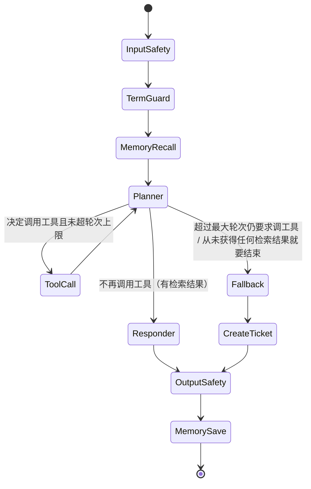

# Agent 自主规划设计方案

对应 `docs/ARCHITECTURE.md` §3.2 "Planner（推理/工具决策节点）"——把 `app/agent/graph.py`
里当前"检索固定跑一次 + 按有无结果路由"的**确定性简化实现**，换成真正由 LLM 自主决定
"调不调工具、调哪个、调几轮"的 ReAct 风格状态机。本文档只做设计，不动代码；实施顺序见
第9节，供后续按 TDD 逐条落地。

## 1. 现状与差距

`build_agent_graph()`（`app/agent/graph.py:33`）里的注释已经诚实写明了当前的简化：

> Planner 简化为确定性流程：TermGuard 强制注入 + 始终执行一次混合检索，再按"是否检索到
> 结果"这一简单信号路由到 Responder 或 Fallback。

差距的根因不在 Agent 层，而在 Provider 层：`app/providers/base.py` 的 `ProviderRequest`/
`ProviderResult` 完全没有 function-calling 的字段（`tools`/`tool_choice`/`tool_calls`），
`OpenAICompatibleChatProvider.complete()` 也只解析 `message.content`，没处理
`message.tool_calls`。没有这一层，Planner 无从"决策调用哪个工具"。

## 2. 总体思路：分阶段、可回退、可用评测框架验证

这是目前三项待办里改动面最大的一个（Provider 层 + Agent 层都要动），照搬多租户隔离那种
"一次性全量替换"的做法风险偏高——一旦 Planner 决策质量不如预期（成本、延迟、稳定性都
可能变差），没有退路。因此采用分阶段、显式开关的路线：

1. **Provider 层**：新增 tool-calling 支持，纯增量字段（默认值兼容），零现有测试受影响。
2. **工具实现层**：把 `vector_search_tool`/`graph_query_tool`/`structured_filter_query_tool`
   包装成独立可测试函数，
   此时还没接入图，同样零现有测试受影响。
3. **新 Planner 子图**：`build_agent_graph()` 新增 `enable_autonomous_planning: bool = False`
   参数。`False`（默认）时完全复用现有确定性流程，保证已有 160 个测试和生产行为不变；
   `True` 时启用 Planner→ToolCall 循环。
4. **灰度验证**：用已经建好的评测框架（`app/eval/runner.py`）分别跑
   `enable_autonomous_planning=False/True` 两组，比较 Context Recall/Faithfulness/
   Answer Relevancy/专有名词准确率 + 实际耗时和 LLM 调用次数，用数据决定要不要把默认值
   翻转为 `True`，而不是凭感觉切换。

这个开关本身就是一层安全网：Planner 出问题时，把开关关掉就能立刻回退到已验证过的确定性
行为，不需要紧急回滚代码。

## 3. Provider 层改造

### 3.1 数据结构（`app/providers/base.py`）

```python
@dataclass(frozen=True)
class ToolCall:
    id: str
    name: str
    arguments: str  # 原始 JSON 字符串，和 OpenAI 的 tool_calls[i].function.arguments 一致

@dataclass(frozen=True)
class ProviderRequest:
    messages: list[dict[str, str]]
    options: dict[str, Any] = field(default_factory=dict)
    tools: list[dict[str, Any]] | None = None       # 新增，OpenAI function-calling schema
    tool_choice: str | dict[str, Any] | None = None  # 新增，"auto"/"none"/指定某个工具

@dataclass(frozen=True)
class ProviderResult:
    text: str
    raw: dict[str, Any] = field(default_factory=dict)
    tool_calls: list[ToolCall] | None = None  # 新增；非 None 时 text 可能为空字符串
```

两个 dataclass 都是 frozen + 新字段带默认值，现有所有调用点（`answer_question`、
`llm_judged_metrics`、`term_guard` 等）不用改一行。

### 3.2 `OpenAICompatibleChatProvider.complete()` 改动

```python
payload = {"model": self._model, "messages": request.messages, **request.options}
if request.tools:
    payload["tools"] = request.tools
if request.tool_choice:
    payload["tool_choice"] = request.tool_choice

response = await self._client.post(..., json=payload)
body = response.json()
message = body["choices"][0]["message"]
text = message.get("content") or ""  # 调用工具时 content 通常是 None，不能再假设必有值
tool_calls = None
if message.get("tool_calls"):
    tool_calls = [
        ToolCall(id=tc["id"], name=tc["function"]["name"], arguments=tc["function"]["arguments"])
        for tc in message["tool_calls"]
    ]
return ProviderResult(text=text, raw=body, tool_calls=tool_calls)
```

关键改动点：`text = message.get("content") or ""` ——现有代码 `body["choices"][0]["message"]["content"]`
在纯工具调用轮次会因为 `content` 是 `None` 而不报错但把 `None` 当字符串传下去，是一个真实
的隐藏 bug，必须顺手修掉。

### 3.3 厂商兼容性（需要在实施时用真实 API 验证，不能只凭文档假设）

Qwen（DashScope 兼容模式）、DeepSeek、智谱 GLM、Kimi 官方文档都宣称支持 OpenAI 风格的
`tools`/`tool_choice`/`tool_calls`，理论上 `_OpenAICompatibleClient` 这一层不需要为每家
单独适配。但"文档宣称支持"和"某个具体模型版本调用稳定性"是两回事——小模型/低价位模型
对 `tool_choice="auto"` 的遵循度参差不齐（可能瞎编参数、可能忽略 schema 直接纯文本回答）。
**实施时第一步必须是对每个实际会启用 Planner 的 provider+model 组合跑一次真实 API 冒烟
测试**，确认 tool_calls 能正确解析，而不是假设"OpenAI 兼容"就等于"function-calling 兼容"。

## 4. 工具定义与安全边界

### 4.1 工具清单（对应 ARCHITECTURE.md §3.3）

| 工具名 | LLM 可控参数 | 系统强制注入（LLM 不可控） | 实现 |
|---|---|---|---|
| `vector_search_tool` | `query: str`, `top_k: int`（可选，默认3） | `tenant_id` | 内部调用 `hybrid_search()` |
| `graph_query_tool` | `entity_name: str`, `entity_type: str`（可选，同名实体存在多个类型时用于消歧） | `tenant_id` | 内部调用 `resolve_term()`（`app/graphrag/ontology.py`）+ `graph_client.query_subgraph()` |
| `structured_filter_query_tool` | `anchor_term_type: str`, `constraints: list`, `group_by`（可选）, `limit: int`（可选，默认20） | `tenant_id`、该租户已确认的 term_type/relation_type schema | 按属性/关系条件反查实体；内部调用 `run_structured_filter_query()`（解析→按已确认 schema 校验→`graph_client.execute_structured_filter_query()`） |

`create_ticket_tool` **不**开放给 Planner 调用——继续保持架构图里 `Fallback --> CreateTicket`
的确定性路径，工单转人工是安全兜底动作，不能让 LLM 自主决定"要不要转人工"。

### 4.2 关键安全设计：tenant_id 绝不能是 LLM 可控参数

这是这份设计里最容易被忽视、也最需要显式强调的一点：工具的 JSON Schema 里**根本不能
出现** `tenant_id` 字段（避免 LLM 有机会"被诱导"填一个别的租户 ID）。执行工具调用的
节点（`tool_call_node`）从 `AgentState["tenant_id"]` 取值并强制传给 `hybrid_search()`，
完全忽略 LLM 返回的 `arguments` JSON 里是否意外包含类似字段——双重保险：schema 不给、
执行时也不信。这和刚做完的多租户隔离工作是同一个原则的延伸：**隔离维度永远由系统层
注入，不能是任何"用户输入/模型输出"能触达的参数**。

### 4.3 Prompt injection 风险

工具执行结果（检索到的文档片段）会被塞回对话历史，作为下一轮 Planner 推理的输入——
如果文档内容被恶意构造，理论上可以尝试影响 Planner 的下一步决策（比如诱导它反复调用
工具、或在最终回答里泄露不该说的内容）。缓解手段：
- 当前暴露的工具全部是只读检索，没有任何写操作或敏感副作用，最坏情况是浪费几轮调用
  或检索到错误内容，不会造成越权操作；
- `OutputSafety` 节点（规则检查 + 语义安全审查）无论走 Planner 路径还是走原来的确定性
  路径都会执行，是最后一道闸——但这只是"事后兜底"，不是"事前免疫"，本设计不试图完全
  解决 prompt injection，只做到"不比现状更差 + 有下限"。

## 5. `AgentState` 扩展字段（`app/agent/state.py`）

```python
class AgentState(TypedDict, total=False):
    ...  # 现有字段不变
    planner_messages: list[dict[str, str]]   # Planner 专用对话历史（含 tool 角色消息）
    tool_call_round: int                     # 当前第几轮，从 0 开始
    pending_tool_calls: list[dict[str, str]] # 本轮 LLM 决定要调用的工具（id/name/arguments）
    tool_results: list[dict[str, Any]]       # 累积的工具执行结果，供最终答案溯源 used_sources
    planner_gave_up: bool                    # 达到最大轮次仍要求调工具 → 强制 Fallback 的标记
```

`retrieved_records`/`used_sources` 两个既有字段继续复用：`tool_call_node` 每次执行
`vector_search_tool` 都把结果 merge 进 `retrieved_records`（去重），保证 Fallback 判断
逻辑（"有没有检索到东西"）和现有代码风格一致，不用引入平行的一套判断标准。

## 6. 新状态图拓扑



### 6.1 双重护栏防止死循环

- **状态内计数器**（主要机制）：`tool_call_round` 达到 `max_tool_call_rounds`（默认 3，
  作为 `build_agent_graph()` 新参数）时，`route_after_planner` 直接判 Fallback，不再
  执行 LLM 请求调用的工具。
- **LangGraph `recursion_limit`**（外层兜底）：`agent_routes.py` 调用 `graph.ainvoke()`
  时显式传 `config={"recursion_limit": (max_tool_call_rounds + 1) * 2 + 10}` 之类的
  留余量上限，防止万一状态内计数器逻辑有 bug 时无限循环打满进程资源——这是"belt and
  suspenders"，两层保护互不依赖对方生效。

### 6.2 `Responder` 节点的简化决定（需要显式记录，避免被误认为疏漏）

架构图画的是 `Planner --> Responder` 独立一步，但当 Planner 决定"不再调用工具"时，
它这次 LLM 调用返回的 `text` 本身就已经是基于所有工具结果生成的答案——如果再让
`Responder` 节点单独发起一次 LLM 调用重新生成一遍，等于同一件事花两次 LLM 调用的钱，
纯粹浪费。因此 `Responder` 节点在本设计里简化为**纯格式化节点**（不调用 LLM）：直接
取 Planner 最后一轮的 `text` 作为 `answer_text`，只做来源列表拼接等格式化工作。

这是本设计明确做的简化，不是遗漏：如果未来发现 Planner 停止调用工具时给出的文本质量
不稳定（比如没有引用来源、格式不统一），可以再加回一次"格式化专用"的轻量 LLM 调用，
但那应该是被真实评测数据驱动的决定，不是预先假设需要。

## 7. 测试策略

延续本项目一贯的做法——**不打真实厂商 API，只用 fake/scripted provider**：

- 扩展 `ScriptedLLMProvider`（已在多处测试里重复出现的模式）支持按顺序返回
  `ProviderResult(text="", tool_calls=[ToolCall(...)])` 或
  `ProviderResult(text="最终答案")`，从而在完全不依赖真实网络调用的前提下，确定性地
  测试 Planner 的每一种分支：
  - 调用 1 次工具后得到足够信息直接回答；
  - 连续调用 2 种不同工具（先 `graph_query_tool` 再 `vector_search_tool`）；
  - 达到 `max_tool_call_rounds` 仍要求调用工具 → 强制 Fallback，且**不应该**执行第
    `max_tool_call_rounds+1` 次工具调用（用一个会在被调用时抛异常的假工具函数来断言
    "确实没有被多调一次"）；
  - LLM 返回的 `tool_calls[i].arguments` 里混入了 `tenant_id` 字段 → 断言实际执行
    `hybrid_search()` 时用的还是 `AgentState["tenant_id"]`，而不是 LLM 给的值（这是
    §4.2 安全设计的直接回归测试，必须写，不能只是设计文档里说说）；
  - 工具返回空结果、LLM 仍尝试继续调用别的工具、最终仍然拿到结果的路径。

## 8. 与现有子系统的交互

- **语音首包延迟硬约束**（Stage 6）：Planner 多轮调用意味着多次 LLM 往返，与"首包
  延迟有硬性要求"直接冲突。建议：语音输入触发的请求（`voice_response=True` 或识别到
  来自 ASR 的请求）默认不启用 Planner 路径，或把 `max_tool_call_rounds` 单独压到 1；
  这个联动点需要在 `agent_routes.py` 里显式处理，不能指望 Planner 自己感知延迟预算。
- **记忆模块**：`MemoryRecall` 节点位置不变，继续在 Planner 之前跑，注入的长期记忆/
  近期会话消息作为 `planner_messages` 的一部分参与推理，不需要额外改动。
- **多租户隔离**：`tool_call_node` 是本次改造里唯一新增的、需要重新审视隔离边界的地方
  （见 §4.2）；除此之外 Planner 本身不直接触碰任何存储层。
- **评测框架**：`run_eval_suite()` 目前直接调用 `answer_question()`，不经过 Agent
  graph。若要用评测框架对比 Planner 开/关两种模式，需要先给 eval runner 加一个"走
  Agent graph 而不是走 `answer_question()`"的执行路径——这是一个新的、独立的小任务，
  本设计只指出这个依赖，不在此展开。

## 9. 实施步骤拆分（供后续 TDD 逐条实现，建议按此顺序）

1. ✅ `ProviderRequest`/`ProviderResult`/`ToolCall` 新增字段（纯数据结构，无行为）。
2. ✅ `OpenAICompatibleChatProvider.complete()` 支持 `tools`/`tool_choice` 请求 + 解析
   `tool_calls` 响应（含修掉 `content` 可能为 `None` 的隐藏 bug）。
3. ✅ `vector_search_tool`/`graph_query_tool` 独立函数 + 各自的工具 JSON Schema 常量。
4. ✅ `AgentState` 新增字段。
5. ✅ `planner_node`/`tool_call_node`/`route_after_planner` 三个新节点/路由函数，先在
   独立测试里验证（不接入 `build_agent_graph`）。
6. ✅ `build_agent_graph()` 加 `enable_autonomous_planning`/`max_tool_call_rounds` 参数，
   接入新拓扑，`False` 时保证现有全部测试原样通过。
7. ✅ `agent_routes.py` 接入 `recursion_limit` 外层护栏 + 语音请求的降级策略（§8）。
8. ✅ 打通评测框架对 Agent graph 的执行路径：`run_eval_suite_via_agent_graph()` +
   `compare_planner_modes()` + `--compare-planner` CLI。代码路径已就绪，但**还没有
   拿真实知识库+真实 embedding/LLM 凭证跑过一次真实对比**——这一步需要一个真实
   Milvus 实例、真实摄取过的文档、真实 embedding API key，本环境目前都没有配好，
   仍然是"翻转默认值"这个决定缺的最后一块数据支撑。

### 真实厂商 API 冒烟测试结果（DeepSeek，2026-08-05）

用 `deepseek-chat` 跑了三个场景（脚本未入库，属一次性验证）：
1. 明确需要检索的问题——模型正确选择调用工具，**且一次性并行请求了两个工具**
   （`vector_search_tool` + `graph_query_tool`），证明 DeepSeek 支持 parallel
   function calling。本实现已经能正确处理（`run_planner_turn` 本就是把
   `result.tool_calls` 整个列表存进 `pending_tool_calls`，`run_tool_calls`
   逐个执行），不用额外改动，但有个参数含义要注意：`max_tool_call_rounds`
   数的是"LLM 轮次"不是"工具调用次数"——如果模型习惯一轮请求多个工具，
   实际执行的工具调用总数可能远大于轮次上限本身，调 `max_tool_call_rounds`
   时要按这个口径估算。
2. 不需要检索的闲聊——模型不调用任何工具，直接回答，`tool_calls` 为 `None`。
3. 把场景1的工具结果按 OpenAI 协议格式（`assistant.tool_calls` + `role=tool`
   带 `tool_call_id`）回填后发起第二轮——模型正确读取了工具结果并基于其中
   内容给出最终答案，证明多轮消息历史格式是被 DeepSeek 正确接受的。

一个和文档描述略有出入、但不影响正确性的观察：调用工具时 `message.content`
**不一定是 `None`**——DeepSeek 在场景1里 `content` 和 `tool_calls` 同时非空
（先写了一段"我来帮你检索"之类的话，再附带工具调用）。§3.2 的
`text = message.get("content") or ""` 已经能正确处理这种情况（不会因为
`content` 有值就误判为"这是最终答案"——`route_after_planner` 的判断依据
始终是 `tool_calls` 是否存在，不是 `content` 是否为空），无需改动。

### 补充：`deepseek-v4-flash` 模型验证（2026-08-05）

同一套三场景换成 `deepseek-v4-flash` 重跑，全部通过，还跑出一个比 `deepseek-chat`
更有价值的真实案例：

- 场景1这次只请求了单个工具（不是并行），且 `content` 为空字符串——同一个厂商
  不同模型在"content 是否为空"、"是否并行调用"这两点上表现不一致，进一步印证
  §3.2 不能依赖 `content` 是否为空来做路由判断，只能依赖 `tool_calls` 是否存在。
- 场景3（回填场景1的检索结果后发起第二轮）里，模型**没有直接给出最终答案，
  而是又发起了一次 `vector_search_tool` 调用**（换了更具体的检索词再查一次）。
  这个脚本本身没有再继续下一轮，所以看到的是"又要调用工具"而不是"最终答案"——
  但这恰好是一个真实证据：确实存在需要 2 轮以上工具调用才能给出答案的真实
  模型行为，不是本设计凭空假设的场景，`max_tool_call_rounds` 默认值给到 3
  是有必要的余量，不是过度设计。

**尚未做、需要在真正打开开关前完成的事**（不要误认为已经生产就绪）：
- 只验证了 DeepSeek 家的两个模型；Qwen/智谱 GLM/Kimi 仍未做过真实冒烟测试，
  不能假设它们的 tool-calling 行为（尤其是 parallel function calling 支持
  与否、`content` 是否为空）和这两个模型一致。
- `Settings.agent_enable_autonomous_planning` 默认仍是 `False`，第8步没做意味着没有
  真实数据支撑"该不该打开"这个决定。
- Prompt injection（§4.3）只是指出了风险，没有专门的检测/防护机制。

---

*第1-8步全部已实施完成（2026-08-05）；DeepSeek 两个模型的真实 API 冒烟测试已通过
（2026-08-05）。尚未做的：拿真实知识库+真实凭证跑一次 `--compare-planner` 得到
真实对比数据、其余三家厂商（Qwen/GLM/Kimi）的冒烟测试。*
