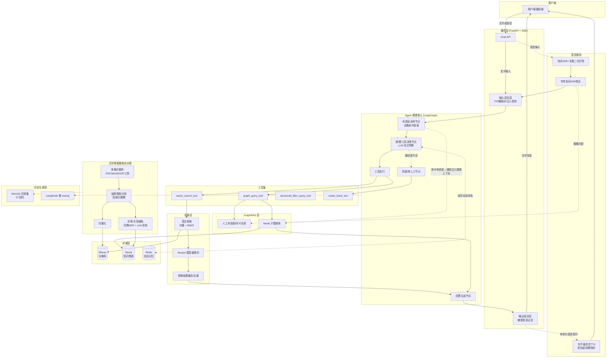
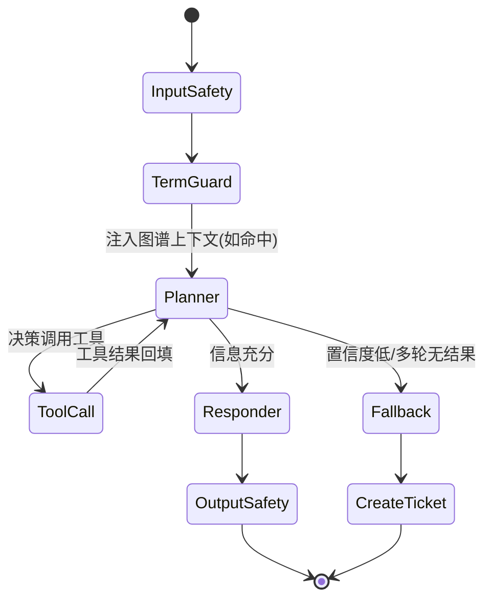
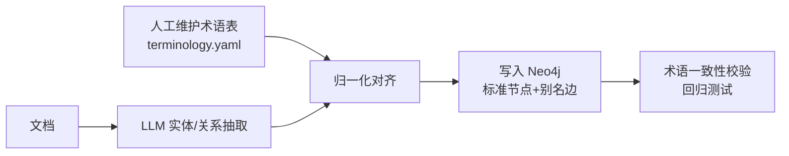
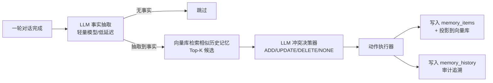
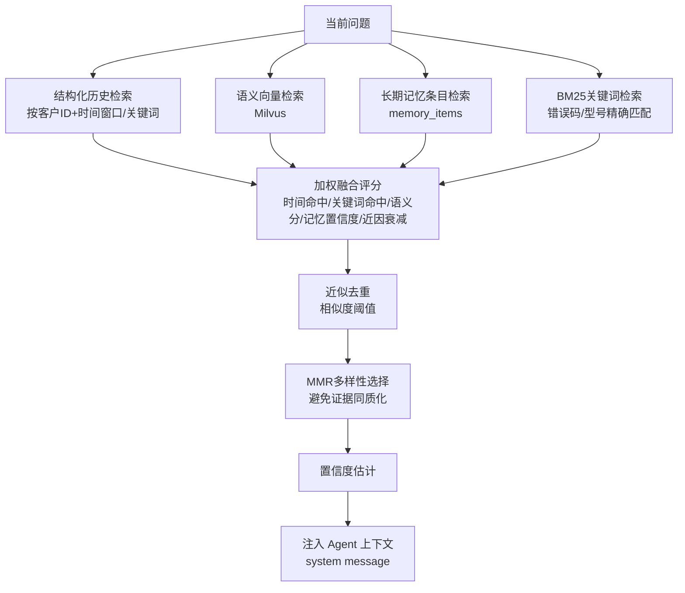
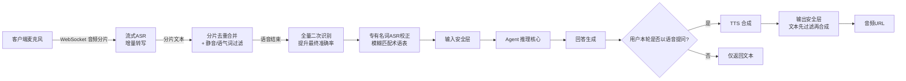
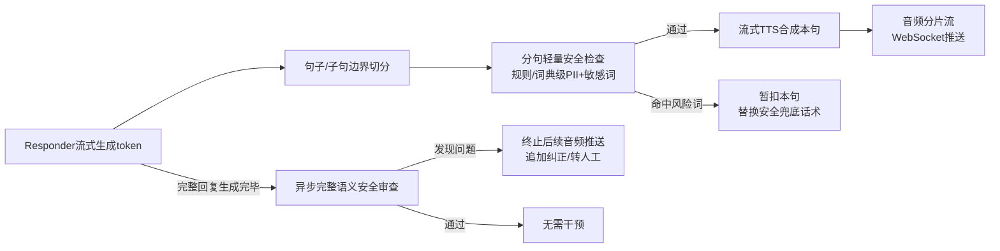
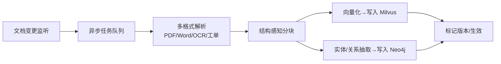

# 企业产品/SaaS客服问答机器人 — 架构设计方案

> 状态：v1.0 设计定稿（经需求梳理会议确认）
> 场景：企业产品/SaaS 客服问答，专有名词以功能模块名、API 字段、配置参数、错误码为主
> 核心目标：① 文档知识召回准确　② 基于知识图谱的专有名词准确

---

## 1. 设计约束与前提

| 维度 | 决策 | 说明 |
|---|---|---|
| 业务场景 | 企业产品/SaaS 客服 | 专有名词密集（模块名/错误码/配置参数），对准确性要求高于开放域问答 |
| 文档规模与格式 | 大规模、混合格式（PDF/Word/扫描件/工单历史，万篇级） | 需要健壮的解析层（含 OCR），不能只支持 Markdown |
| 大模型 | 国产云 API（Qwen/智谱/DeepSeek 等商用接口） | 数据不出境；需验证具体模型的 function calling 稳定性 |
| Embedding | 国产云 API Embedding（Qwen/BGE 系列商用接口） | 与 LLM 同供应商生态，中文语义理解更优 |
| Agent 编排框架 | LangGraph | 显式状态机，便于插入强制性安全网节点，支持 checkpoint/人工介入 |
| 向量数据库 | Milvus | 支持 hybrid search（向量+稀疏检索）与 metadata 过滤，适合万篇级规模 |
| 图数据库 | Neo4j | Cypher 生态成熟，与 LangChain/LangGraph 集成完善 |
| 知识图谱构建 | 人工术语表 + LLM 抽取双轨制 | 术语表提供基准真相，LLM 抽取结果强制对齐术语表做归一化 |
| 检索路由 | LLM 自主决策调用工具 + 轻量强制安全网 | 保留 Agent 推理灵活性，同时用词典命中兜底，避免漏查图谱 |
| 向量检索策略 | 混合检索（向量+BM25）+ Rerank 模型 | 兼顾语义召回与关键词精确匹配（错误码、型号等） |
| 分块策略 | 结构感知分块 + 层级元数据 + parent-child 检索 | 保留表格/步骤说明完整语义，命中小块可回溯大块上下文 |
| 对话记忆 | 分层记忆：会话滑窗+摘要（短期）+ Mem0 风格结构化长期记忆（跨会话） | 借鉴 Mem0 与本地项目 eukka 的记忆子系统设计，支持事实级冲突消解与主动跟进，而非仅做摘要压缩，详见第 6 节 |
| 主动性 | 客户画像驱动的主动跟进引擎 + 频率治理策略 | 在工单长期未处理/已知故障修复后主动触达客户，避免过度打扰，详见第 6.5 节 |
| 语音输入 | 实时流式 ASR（WebSocket 分片+增量文本）+ ASR 专有名词校正 | 参考本地项目 eukka 的 asr_stream 实现，复用第 4 节术语表纠正同音字误识别，详见第 7 节 |
| 语音输出 | 按需触发 + 句子级流式合成（首包延迟为硬性指标） | TTS provider 必须支持流式分片合成而非批量HTTP接口；输出安全层拆分为"分句轻量检查+异步完整审查"，详见第 7.3 节 |
| 兜底策略 | 低置信度时明确告知 + 转人工工单 | 客服场景禁止幻觉兜底；工单系统先用抽象接口 mock |
| 评估体系 | 评测集 + RAGAS 类自动化指标，接入 CI | 验证并持续监控召回准确率与专有名词准确率，防止索引更新引起回归 |
| 索引更新 | 异步增量流水线 | 文档变更触发局部重新处理，不做全量重建 |
| 服务层 | FastAPI + SSE 流式输出 | 提升客服交互的响应感知速度 |
| 部署 | Docker Compose（单机/小集群）+ LangSmith 类 tracing | 运维成本低，推理链路可观测 |
| 多租户 | 按产品线/租户隔离（预留设计） | 向量库用 collection/partition 隔离，图谱节点打 tenant_id 标签 |
| 内容安全 | 输入输出安全层（敏感词/PII/prompt injection 防护） | 客服场景基本合规要求 |

---

## 2. 整体架构图



---

## 3. Agent 推理流程详解（核心机制）

这是满足"符合 Agent 推理架构"要求的核心设计，基于 LangGraph 状态机实现，而非简单的单轮 RAG 调用。

### 3.1 状态图节点



### 3.2 关键节点职责

- **TermGuard（术语安全网节点）**：这是解决"LLM 自主决策可能漏调图谱工具"这一风险的关键补丁。在 Planner 之前，用轻量级词典匹配（术语表 + 模糊匹配）扫描用户问题，一旦命中专有名词候选项，**强制**将对应的图谱子图查询结果作为上下文注入，不依赖 LLM 自主判断是否需要查图谱。LLM 仍自主决定是否额外调用向量检索工具——两者不冲突。
- **Planner（推理/工具决策节点）**：LLM 根据当前状态（用户问题 + 已注入上下文 + 历史工具结果）决定下一步：调用 `vector_search_tool`、调用 `graph_query_tool`、直接回答，或判定为无法回答转 Fallback。支持多轮工具调用（ReAct 风格），LangGraph 的图结构保证循环边可控、可加最大迭代次数保护。
- **Fallback（兜底节点）**：当检索结果置信度分数低于阈值，或达到最大工具调用轮次仍未获得足够信息时触发，生成"未找到确切答案"的明确话术，并调用 `create_ticket_tool` 转人工。**不允许**在此状态下让 LLM 自由发挥回答。

### 3.3 工具定义

| 工具 | 输入 | 输出 | 说明 |
|---|---|---|---|
| `vector_search_tool` | query, tenant_id, top_k | 混合检索+rerank 后的文档片段列表（含来源、置信度分数） | 内部串联 Hybrid Search → Rerank → Fusion |
| `graph_query_tool` | 实体/关系查询意图 | 子图三元组 + 归一化后的标准名称 | 内部先查术语表做实体链接，再执行 Cypher 查询 |
| `structured_filter_query_tool` | anchor_term_type, constraints（属性/关系条件）, group_by, limit | 满足条件的实体列表（含已声明属性）或分组统计 | 按属性/关系条件反查实体；字段/关系类型先按租户已确认 schema 校验再拼 Cypher |
| `create_ticket_tool` | 用户问题, 会话摘要, 已尝试的检索结果 | 工单 ID | 当前为抽象接口 mock 实现，后续可插拔对接具体工单系统 |

---

## 4. GraphRAG 层：专有名词准确性保障机制

这是满足"基于 graph 的专有名词准确"要求的核心设计。

### 4.1 双轨制构建流程



- **术语表（基准真相）**：人工维护的 YAML/表格，包含标准名称、别名/同义词、类型（模块名/错误码/参数名等）。这是权威数据源，LLM 抽取结果必须向其对齐，而不是反过来。
- **LLM 抽取归一化**：LLM 从文档中抽取实体/关系候选后，与术语表做实体链接（entity linking）——优先规则/词典精确匹配，精确匹配失败时用 difflib 字符串相似度做模糊匹配兜底（阈值 0.75，取相似度最高的单一建议，见 `app/graphrag/normalization.py::find_fuzzy_candidate_standard_name`），模糊命中同样不自动入库，连同建议标准名一并进入人工待审核队列（`app/graphrag/review_queue.py`）。刻意不引入向量相似度、不持久化置信度分数——字符串相似度已能覆盖候选名的字面偏差场景，见 `docs/superpowers/specs/2026-08-07-graphrag-entity-linking-fuzzy-matching-design.md` §2.1 的取舍说明。
- **图谱结构**：标准实体节点（`:Term {tenant_id, node_key, standard_name, type, ...extra_properties}`）之间用 `ALIAS_OF` 以及各租户在 `tenant_relation_types` 表里自助定义、确认的关系类型（详见 `app/graphrag/ontology_relations.py`；`app/graphrag/neo4j_client.py::merge_relation` 只做关系类型名字合法性校验和 `ALIAS_OF` 保留字拦截，不再维护固定的关系类型白名单——见 2026-08-16 的 ETL 写入引擎改造）连接，别名作为独立节点通过 `ALIAS_OF` 指向标准节点，保证查询时无论用户说的是别名还是标准名都能定位到同一实体。
- **node_key（稳定身份键）**：`node_key` 才是 SQLite 主键和 Neo4j `MERGE`/关系匹配的真正依据，创建后永不改变；`standard_name` 降级为普通展示属性，可随时修改（改名）而不触发特殊处理，也不会让已有的关系边失联。LLM 抽取场景下 `node_key` 在创建时直接取当时的 `standard_name` 值，对现有用户无感；结构化 ETL 场景下 `node_key` 按 `node_key_template`（`ontology_term_types` 上声明）从源数据的稳定字段拼接而成，与展示名完全解耦——这是为了让 ETL 场景重复同步时不需要自己判断"改名 vs 新建"（详见 ADR-0003）。

### 4.2 查询时保障

- `graph_query_tool` 收到候选实体后，第一步始终是"别名→标准名"归一化查询，再基于标准名做子图遍历，确保返回给 LLM 的上下文使用统一、准确的专有名词，避免同一概念因表述不同被误判为不同实体。

---

## 5. 检索层：召回准确性保障机制

这是满足"文档知识召回准确"要求的核心设计。

1. **结构感知分块**：按标题层级/段落/表格边界切分，每个 chunk 携带章节路径、文档类型等元数据；采用 parent-child 检索——小 chunk 参与向量匹配保证精度，命中后回溯返回其所属的大 chunk 保证上下文完整（避免表格、步骤说明被截断）。结构切分出的 chunk 超过大小阈值（默认 800 字符）时，会再走一层递归的按大小兜底切分（段落 → 句子 → 硬截断，见 `app/ingestion/chunking.py::split_oversized_chunks`），切分后的小块才送入向量化；图谱关系抽取则继续使用原始、未经过这层兜底切分的结构化 chunk，以保留完整上下文。
2. **Query 改写（解决原始 query 直接向量化检索效果差的问题）**：客服提问往往口语化、简短、指代不全（"登录不了""这个报错咋整"），与文档规范化的书面表达存在语义鸿沟，直接对原始问题做 embedding 检索召回有限。引入一个轻量 LLM 改写步骤：
   - 结合第 6 节对话记忆（近期轮次/澄清状态）补全指代，把"这个报错"之类的模糊指代展开为具体实体；
   - 结合第 4 节术语表做术语归一化，把口语化描述改写为标准术语（如把"登录不了"改写为包含"登录失败""认证模块""错误码"等标准词的检索 query），直接复用已有的术语归一化基础设施而非另起一套；
   - 改写失败/超时/置信度不足时直接回退用原始 query，不阻塞主链路——与第 6 节事实抽取、时间改写器等 LLM 辅助步骤统一遵循"LLM 失败必须有规则兜底"的设计原则；
   - **不做替换式改写，只做并行补充**：改写后 query 的向量检索结果，与原始 query 的向量检索结果、BM25 结果一起送入第 3 步的 RRF 融合，而不是用改写结果替换原始检索——即使某次改写引入偏差，原始检索路径仍能兜底覆盖，避免"改写反而让召回变差"的风险；
   - 进阶可选项：HyDE（让 LLM 先生成一段"假设性回答"，再对该回答做 embedding 检索，比直接改写问题更能缩小 query-document 语义鸿沟），实现细节见 5.1，需在评测集上 A/B 对比后再决定是否启用，不纳入首版默认范围。
3. **混合检索**：原始 query 向量检索、改写 query 向量检索、BM25 关键词检索（精确命中错误码、参数名等专有名词）三路并行执行。三路分数量纲不同（余弦相似度 0-1 有界，BM25 无界），不能直接比分合并，因此用 **RRF（Reciprocal Rank Fusion，`score = Σ 1/(k+rank_i)`，k 通常取 60）** 只依据每路的排名位置做融合排序，再取融合后的 top-N 送入 Rerank——这一步同时解决了"多路怎么合并"和"往下传多少候选给昂贵的 cross-encoder"这两个问题，避免"每路各截固定数量再拼接"这种缺乏依据的做法。
4. **Rerank**：融合排序仅用于圈定候选池，最终排序由 cross-encoder 重排序模型对候选片段精排给出，弥补 RRF 只看排名、不看语义相关性的局限。
5. **置信度分数**：Rerank 后的分数作为下游 Planner 判断"信息是否充分"、是否触发 Fallback 的依据。

### 5.1 HyDE 实现细节（进阶可选项）

若 A/B 评测证实 HyDE 对模糊问题有正向收益，具体实现方式：

- **生成假设文档**：用轻量 LLM，prompt 类似：
  > "你是 XX 产品客服知识库的文档撰写者。请针对下面的问题，写一段可能出现在产品文档/FAQ 中的答案段落（100-200字），只需符合文档的语言风格和结构，不要求内容绝对正确。问题：{query}"
  单样本生成，不做原论文里的多样本采样+embedding平均，控制额外延迟在可接受范围内。
- **专有名词幻觉防护（针对本项目"专有名词准确性"要求的关键补丁）**：prompt 中显式约束"不确定的专有名词/错误码不要编造具体值，用类别词代替"（如写"某错误码"而非编一个不存在的"E503"）；假设文档生成后，先过一次第 4 节术语表模糊匹配，若命中"疑似编造的专有名词"（提到了形似标准术语但未精确命中的词），直接丢弃该假设文档，回退到不使用 HyDE 的这一路，而不是带着幻觉内容去检索。
- **向量化与检索**：用与文档库同一套 embedding 模型对假设文档做 embedding（原始 query 不重复 embedding），检索 Milvus 返回真实文档片段——假设文档本身不作为证据出现在最终上下文里，是"引路"用的中间产物，检索完即弃，不落库、不进对话记忆。
- **失败兜底**：LLM 生成超时/失败/为空时，直接跳过 HyDE 这一路，不影响原始 query 向量检索、改写 query 向量检索、BM25 三路的正常运行，同样遵循"LLM 辅助步骤必须有规则兜底"的统一原则。
- **并入融合排序，而非独立生效**：HyDE 检索结果作为混合检索的第四路，与原始 query 向量检索、改写 query 向量检索、BM25 结果一起送入 RRF 融合——即使某次 HyDE 生成质量不稳定，其影响也只是"融合排序里的一路输入"，不会让整体检索结果失控。
- **上线策略**：先在评测集上分别对比"有/无 HyDE"两组的 Context Recall、专有名词准确率指标，尤其关注含精确错误码/型号的问题子集是否回归，确认无负向影响后再灰度上线，不作为默认开启项直接上生产。

---

## 6. 对话记忆模块深化设计（借鉴 Mem0 + 本地项目 eukka 经验）

### 6.0 现状与升级动机

初版方案中的"短期滑窗+摘要压缩"只解决了单会话内的 token 膨胀问题，存在三个局限：

- 摘要是有损压缩，无法支持"一个月前你告诉过我 XX 配置/环境"这类跨会话精确回忆；
- 新旧信息冲突时（客户改了主意、纠正了之前的错误描述）只会被摘要覆盖，无法显式识别并更新或撤销；
- 完全被动响应，无法在客户未主动提问时主动跟进（如工单长期未回复、已知故障修复后应主动告知受影响客户）。

参考 Mem0 的"事实抽取 + 冲突决策"范式，以及本地项目 eukka（`app/pipeline/_impl/memory_*`、`app/pipeline/proactive_ops.py`）中已验证的记忆子系统实现，将对话记忆升级为分层、可演化、具备主动性的记忆体系。

### 6.1 分层记忆模型

三层记忆，职责分离：

| 层级 | 存储 | 生命周期 | 用途 |
|---|---|---|---|
| 会话短期记忆 | Redis（滑窗） | 单会话 | 保留最近 N 轮原始对话，支持指代消解 |
| 会话摘要 | Redis/关系库 | 单会话 | 超出滑窗的历史压缩为摘要，滚动合并（沿用初版"短期滑窗+摘要压缩"设计） |
| 长期结构化记忆 | 关系库（`memory_items` 表）+ Milvus（语义投影） | 跨会话，按 `customer_id` 持久化 | 客户的偏好、已确认的产品配置、历史问题结论等"事实"，可被后续对话更新或废弃 |

三层记忆的写入/召回互相独立又协同：短期层保证当前对话连贯，长期层保证"记得住"客户的历史事实。

### 6.2 写入路径：事实抽取 → 冲突决策 → 动作执行（Mem0 风格）



- **事实抽取**：用轻量/低成本模型从单轮对话中抽取可长期记忆的事实（客户偏好、已确认的环境信息、长期约束），忽略寒暄和无意义内容，仅输出结构化 JSON；超时/失败时降级为空事实，不阻塞主对话响应。
- **冲突决策**：抽取到新事实后，先用向量检索找出该客户已有的相似历史记忆作为候选，再由 LLM 判定动作：
  - `ADD`：历史不存在，新增记忆条目；
  - `UPDATE`：同一主题但内容有变化（如客户更换了套餐/环境），更新已有条目并保留旧值审计；
  - `DELETE`：新事实明确否定旧事实（如客户说"之前那个已经不用了"）；
  - `NONE`：重复或无价值，不写入。
  - LLM 失败/超时时降级为规则兜底（未出现过的事实直接 `ADD`，已出现过的判 `NONE`），保证系统在异常情况下不中断。
- **异步 consolidation 队列**：事实抽取与冲突决策不阻塞对话响应，作为后台任务异步执行，具备幂等 dedupe key（防止重复入队）、失败重试与死信队列，避免因 LLM 抖动影响客服交互体验。
- **记忆纠错入口**：客户可显式反馈"你记错了"，触发同一条冲突决策链路即时修正，而不必等下一次自然对话带出新事实。

### 6.3 召回路径：多源融合 + 加权排序 + 去重

单一向量检索对客服场景不够——它无法区分"客户上次报过的错误码"和"客户当前语义相似的新问题"。参考 eukka 的多源召回融合设计：



- 四路并行检索（结构化时间范围查询、语义向量、长期记忆条目、BM25 关键词），各自独立超时与降级——某一路超时不阻塞整体，标记 partial 并在系统提示中告知"部分证据可能不完整"。
- 加权融合评分：不同来源赋予不同基础权重，并叠加近因衰减（越新权重越高，超出窗口期衰减到 0）。
- 近似去重 + MMR（最大边际相关性）二次筛选，避免召回的多条证据高度雷同挤占上下文预算。
- 输出整体置信度分数：证据不足或分数过低时，直接触发第 3 节的 Fallback 兜底（转人工），而不是让 LLM 勉强作答——这与第 5 节检索层的置信度机制共用同一套阈值语义。

### 6.4 时间/指代解析与澄清状态机

客服对话中大量出现"上次那个报错""上周提的工单"这类模糊的时间/指代表达，设计专门的解析层：

- **LLM 时间改写器**：将自然语言时间表达解析为结构化 UTC 时间窗口（如"上周五" → 具体起止 ISO 时间），附带置信度；解析失败或置信度不足时回退到规则引擎（正则匹配"上周""昨天"等常见模式）。
- **未来时间窗口保护**：识别到用户提到的是未来时间（如解析异常导致窗口错误）时，暂停检索并转为向用户澄清，避免返回无意义的空结果。
- **待澄清状态机**：当问题模糊到无法确定检索范围时，先生成一句澄清追问（"你想查询哪一天的记录？"）并记录"待澄清"状态（带 TTL）；用户下一轮如果只回复了一个时间/日期，自动识别为对该澄清的补充，拼接回原始问题重新检索，无需用户重复完整描述问题。这是提升"智能化"体感的关键交互细节。

### 6.5 主动性引擎：从被动问答到主动跟进

这是直接回应"提高主动性水平"要求的核心设计，参考 eukka 的跟进调度与频率治理机制（`proactive_ops.py`），移植到客服场景：

**触发场景**（区别于 eukka 面向个人任务提醒的跟进，客服场景的主动触发源）：

- 工单长期处于"待处理/待客户确认"状态超过阈值时间 → 主动跟进"您的问题是否已解决？"
- 已知故障修复上线后，反查历史反馈过该问题的客户 → 主动告知修复情况（比客户自己重新提问更专业）；
- 客户在对话中表达了"稍后再试"之类的延迟意图，且预计时间已到 → 主动确认结果。

**频率治理策略**（避免打扰）：

- 基于客户画像（是否为付费/VIP客户、历史对主动消息的反馈标签如"太主动了"/"希望更主动"）动态调整跟进的最小时间间隔与单位时间窗口内的最大发送次数；
- 客户一旦标记过"太主动了"，自动放宽跟进间隔并降低发送频率上限，反之则收紧间隔、提高上限；
- 跟进文案在实际发送前基于工单最新状态刷新，避免发送过期内容（例如工单已经被处理但提醒文案还停留在旧状态）。

**客户画像驱动的语气/详略调整**：跟进文案的语气（正式/亲切）、详略程度（简洁/详细）依据客户画像中的沟通偏好动态生成，而非固定模板。

### 6.6 记忆一致性与可观测性

- **显式投影策略**：每类记忆对象（对话轮次/衍生事件/长期记忆条目）声明主存储与投影目标（如"长期记忆条目主存于关系库，投影到 Milvus 供语义检索"），投影失败时记录审计日志而不静默丢失，便于巡检和修复不一致，与第 9 节评估体系共用同一套可观测性基础设施。
- **可重放的 consolidation payload**：写入队列的任务载荷保持幂等、可重放，故障恢复后可安全重跑而不产生重复记忆。

### 6.7 目录结构增补

```
app/memory/
├── session_window.py          # 会话滑窗（原 session_memory.py）
├── compaction.py               # 摘要压缩（沿用初版设计）
├── fact_extractor.py           # LLM 事实抽取
├── conflict_resolver.py        # ADD/UPDATE/DELETE/NONE 决策
├── action_executor.py          # 记忆动作执行 + 历史审计
├── consolidation_queue.py      # 异步 consolidation 队列（幂等/重试/死信）
├── recall/
│   ├── recall_service.py       # 多源召回编排
│   ├── recall_ranker.py        # 加权融合 + BM25 + MMR 去重
│   └── temporal_resolver.py    # 时间改写 + 澄清状态机
├── proactive/
│   ├── followup_engine.py      # 主动跟进触发与文案生成
│   └── delivery_policy.py      # 频率治理策略
├── customer_profile.py         # 客户画像（沟通偏好/主动性反馈标签）
└── projection_policy.py        # 存储-投影映射与审计
```

### 6.8 新增架构依赖说明

该升级引入的新组件，需要在原方案基础上补充：

- **关系型存储**：需要一个轻量关系库（PostgreSQL/SQLite，视规模而定）存放 `memory_items`、`memory_history`、`consolidation_jobs`、`recall_clarification` 等结构化表，与 Milvus（语义投影）配合，而非仅靠向量库——这是对第 1 节存储层的补充，非替换。
- **异步任务队列复用**：consolidation 队列可与第 7 节摄取流水线共用同一套 Celery/RQ 基础设施，不需要引入新的队列组件。
- **延迟预算**：多源召回融合在设计上要求各分支独立超时（如 300-500ms 级别）并支持 partial 降级，需要在 SLA 设计中明确"记忆增强"与"核心问答"两条延迟预算线，避免记忆检索拖慢主链路响应。

---

## 7. 语音模块：语音输入与输出（借鉴本地项目 eukka 经验）

### 7.0 设计动机

现有架构只覆盖文本问答，但客服场景中相当比例的用户倾向语音求助（移动端打字不便、问题描述冗长时尤其明显）。新增语音模块需要满足：语音输入准确转写为文本进入现有 Agent 推理链路；语音输出仅在用户以语音提问时按需合成，避免不必要的延迟与成本；且转写结果中的专有名词（错误码、模块名）必须享受与文本输入同等的准确性保障——这是语音场景独有的新风险点，纯文本输入不会遇到。

### 7.1 整体接入位置

语音模块作为输入/输出通道层，衔接在服务层（FastAPI）与 Agent 推理核心之间，**不改变**第 3 节 Agent 状态图的内部结构：ASR 转写文本 → 走原有 InputSafety → TermGuard → Planner… → Responder → 按需流式 TTS（首包延迟为硬性指标，详见 7.3 节）→ 输出安全层 → 客户端。



### 7.2 语音输入：流式 ASR + 专有名词校正

- **接入方式**：参照 eukka 的 `asr_stream` 模式，客户端通过 WebSocket 按分片（如 200-300ms 音频）推送，服务端调用 ASR provider 做增量转写并实时回传 partial 文本，提升等待体感；分片间做文本去重合并（处理跨分片的重叠/重复片段），过滤纯语气词分片（"嗯""啊"等），避免污染最终文本。
- **全量二次识别**：语音结束后追加一次对完整录音的重新转写，弥补分片识别在片段边界处的准确率损失，作为最终进入 Agent 流程的文本——这一步的输出才是"最终文本"，分片阶段的 partial 文本仅用于前端实时展示。
- **专有名词 ASR 校正（新增，直接复用第 4 节 GraphRAG 术语表）**：ASR 对错误码、产品型号等专有名词的识别错误率显著高于日常词汇（同音字/近音字，例如"E502"被误识别为发音相近的其他词）。在全量二次识别文本进入 TermGuard 之前，增加一道校正步骤：对转写文本做模糊匹配/编辑距离比对术语表中的标准名称，当发现"疑似专有名词但未精确命中标准术语"的片段时，提示候选标准名称，交由 LLM 判断替换或原样保留。这一步把语音场景特有的识别误差风险，收敛回第 4 节已经建立的术语归一化基础设施，而不是另起一套校正逻辑。
- **Provider 选型**：ASR 沿用已定的国产云API体系（与 LLM/Embedding 同一供应商，便于统一鉴权与账单管理），走统一的 provider 抽象层，未来可平滑切换/降级到备用供应商——与 eukka 的 provider registry 抽象是同一模式。

### 7.3 语音输出：句子级流式合成，满足首包延迟硬性要求

首包延迟（用户说完话到听到第一段语音）是硬性指标，"等完整回复生成完再合成"不可行，必须把 TTS 接入第 3 节 Responder 的流式生成过程，与 LLM token 输出流水线化：



- **Provider 前提条件（关键约束）**：首包延迟达标的前提是 TTS provider 必须支持真正的流式合成（边合成边输出音频分片），而不是"发送完整文本、等待完整音频返回"的批量 HTTP 接口。本地项目 eukka 的三个 TTS provider 中，只有 VibeVoice（自建 sidecar，`stream_pcm_events`）和 edge_tts 具备这个能力；eukka 默认使用的 DashScope TTS 走的是非流式 HTTP 接口（`dashscope_tts.py` 注释里明确写着"非流式语音合成"），不满足本项目的延迟要求。因此本方案要求 TTS provider 选型必须落在"流式合成"这条产品线上——国产云厂商通常把"批量语音合成"和"实时语音合成"做成两个不同的接口/产品（如阿里云智能语音交互的实时合成 vs 批量合成），选型时要明确核对目标接口是否支持流式分片输出，不能想当然沿用第 1 节里已选定的批量 LLM/Embedding 供应商的默认 TTS 接口。
- **句子级分段合成**：Responder 按 token 流式生成文本时，在句子/子句边界（句号、问号、感叹号，或较长的逗号分句）处切出一个可合成单元，立即送入 TTS 开始合成，与后续文本的生成并行进行——首包延迟由此从"等待完整回复"压缩为"等待第一句生成完成 + 该句的 TTS 合成耗时"两项之和。
- **分句轻量安全检查（第 9 节安全层的拆分，而非绕过）**：每句合成前只做规则/词典级的 PII、敏感词快速检测（毫秒级，不做耗时的 LLM 语义审查），命中风险词的句子暂扣并替换为安全兜底话术，而不是原样播报；完整回复生成完毕后，仍执行一次完整语义级安全审查（第 9 节原有逻辑）作为异步补充。若事后审查发现问题，终止尚未推送/播放的后续音频，并追加纠正话术或转人工。这是延迟与安全之间的明确取舍：接受"先播出、事后纠正"的小概率风险窗口，换取首包延迟达标——该权衡已与你确认，若后续合规要求收紧，可退回"完整安全审查优先"的保守模式，代价是无法满足首包延迟指标。
- **音频传输方式**：由"合成完成后一次性返回音频 URL"，改为通过 WebSocket 推送 PCM/Opus 分片流，与第 7.2 节 ASR 输入侧的 WebSocket 对称，同一条连接可双向承载语音输入分片与语音输出分片，客户端边接收边播放。
- **长文本截断**：截断判断需要提前到"句子切分"阶段逐句累加计数，而非等完整文本生成后再整体截断，避免因等待截断判断而拖慢首句合成；截断阈值的设计思路与第 6 节对话摘要的长度预算保持一致。
- **触发策略不变**：仍是按需触发——仅当客户本轮以语音方式提问时才启动上述流式合成链路，纯文字提问只走文本响应。

### 7.4 隐私与合规

- 语音原始音频（录音分片/完整文件）转写完成后即删除，不做持久化留存，仅保留转写后的文本进入正常的对话记忆/RAG 流程，与第 9 节多租户安全设计的 PII 处理原则一致。
- 若合规要求需留存通话录音，需作为独立可配置选项（留存时长、访问权限），默认不开启。

### 7.5 目录结构增补

```
app/voice/
├── asr_stream_router.py       # WebSocket 流式ASR接入
├── asr_finalize.py             # 全量二次识别
├── asr_term_correction.py      # 专有名词ASR校正（复用 graphrag/ontology）
├── sentence_segmenter.py       # 句子/子句边界切分，驱动流式TTS触发时机
├── tts_stream_provider.py      # 流式TTS provider抽象（要求支持分片合成，非批量HTTP）
├── output_lite_safety.py       # 分句轻量安全检查（规则/词典级PII+敏感词）
└── voice_output_gate.py        # 按需触发策略 + 流式推送编排 + 异步完整审查回调
```

---

## 8. 摄取与增量更新流水线



- 文档变更（新增/修改/删除）触发事件，进入异步队列（Celery/RQ），只处理变化部分，避免万篇级文档下的全量重建成本。
- 向量索引与图谱更新并行执行，互不阻塞；更新完成后做增量版本标记，支持灰度生效和回滚。

---

## 9. 多租户与安全设计

- **多租户隔离**：Milvus 按产品线/租户使用独立 collection 或 partition；Neo4j 节点/关系统一打 `tenant_id` 属性（节点标签本身不区分租户，同一套 `:Term` 标签被所有租户共用，靠属性+关系边上的 `tenant_id` 隔离），所有 Cypher 查询模板强制带租户过滤条件；请求链路中 `tenant_id` 从认证层注入，业务代码不可绕过。
- **`term_type` 按租户隔离**：术语的业务分类（`term_type`，如 `error_code`/`Product`/`SKU`）不再是跨租户共享的全局枚举，而是每个租户在 `ontology_term_types` 表里各自定义、经 draft/confirm 两阶段生命周期确认后才能使用（详见 `app/graphrag/ontology_categories.py`、ADR-0001）——这是为了支持业务域完全不同的租户（如客服问答场景的"错误码/模块"和商品目录场景的"Product/SKU/VariantValue"）共用同一套代码而不互相污染 schema。存量/未显式指定租户的数据统一归属 `tenant_id='default'`。
- **两种接入模式（`ingestion_mode`）**：每个租户标记为 `"extraction"`（LLM 从文档抽取实体/关系，经人工审核队列后写入，默认模式）或 `"etl"`（从租户自己的结构化主数据表确定性转换写入，不经 LLM 推断、不进审核队列）。两种模式共享同一套本体 schema 定义层（分类/关系类型/约束/生命周期）和 Term 双存储写入接口，仅数据来源、写入路径与默认值不同——`checkout_draft` 只对 `"extraction"` 租户播种默认关系类型集合。详见 `docs/superpowers/specs/2026-08-15-etl-driven-schema-construction-design.md`。
- **内容安全层**：输入侧做敏感词/PII 检测与 prompt injection 基础防护（系统 prompt 与用户输入隔离、拒绝指令覆盖尝试）；输出侧做敏感信息过滤，防止图谱/文档中的内部信息（如未脱敏的客户数据）泄露。

---

## 10. 评估体系

- 构建覆盖专有名词的回归测试集（问题-标准答案-标准引用来源三元组），接入 RAGAS 类框架自动计算：
  - 命中率（Context Recall）
  - 忠实度（Faithfulness，回答是否基于检索内容而非幻觉）
  - 答案相关性（Answer Relevancy）
  - 专有名词准确率（自定义指标：回答中出现的专有名词是否与术语表标准名称一致）
- 接入 CI：每次索引 pipeline 或图谱抽取逻辑变更后自动跑评测集，防止召回质量随迭代退化。

---

## 11. 部署与可观测性

- Docker Compose 编排 FastAPI 服务、Milvus、Neo4j、Redis（会话记忆）等组件，适合 MVP 到中型规模。
- 接入 LangSmith 类 tracing，记录 Agent 每一步的工具调用、中间状态、耗时，便于排查"为什么没查到"或"为什么答错"类问题。

---

## 12. 项目目录结构

借鉴 LlamaIndex 的 ingestion/index/query 分层思想，以及 Microsoft GraphRAG 的 index/query 两阶段流水线思路，结合本项目的 Agent 编排需求重新组织：

```
customer_rag/
├── docs/
│   └── ARCHITECTURE.md
├── app/
│   ├── main.py                        # FastAPI 入口
│   ├── config/
│   │   └── settings.py                # 环境变量/多租户配置
│   ├── api/
│   │   ├── routes/
│   │   │   ├── chat.py                # SSE 流式对话接口
│   │   │   └── admin.py               # 知识库管理/术语表维护接口
│   │   └── deps.py                    # 依赖注入（租户上下文等）
│   ├── agent/                         # LangGraph 编排核心
│   │   ├── graph.py                   # 状态图定义（节点+边）
│   │   ├── state.py                   # AgentState 数据结构
│   │   ├── nodes/
│   │   │   ├── input_safety.py
│   │   │   ├── term_guard.py          # 术语强制安全网
│   │   │   ├── planner.py
│   │   │   ├── responder.py
│   │   │   ├── fallback.py
│   │   │   └── output_safety.py
│   │   └── tools/
│   │       ├── vector_search_tool.py
│   │       ├── graph_query_tool.py
│   │       ├── create_ticket_tool.py  # mock 实现，预留真实工单接口
│   │       └── registry.py
│   ├── retrieval/                     # 向量检索层
│   │   ├── embedder.py
│   │   ├── milvus_client.py
│   │   ├── query_rewriter.py          # LLM query改写（指代补全+术语归一化），失败回退原始query
│   │   ├── hybrid_search.py           # 原始query+改写query 向量检索 + BM25
│   │   ├── reranker.py
│   │   └── fusion.py                  # RRF 融合排序 + 候选池截断去重
│   ├── graphrag/                      # 图谱层
│   │   ├── ontology/
│   │   │   └── terminology.yaml       # 人工术语表/同义词表
│   │   ├── extraction/
│   │   │   ├── dictionary_ner.py      # 规则/词典 NER
│   │   │   └── llm_extractor.py       # LLM 抽取 + 归一化对齐
│   │   ├── neo4j_client.py
│   │   └── graph_query_engine.py      # 别名归一化 + 子图查询
│   ├── ingestion/                     # 摄取流水线
│   │   ├── parsers/
│   │   │   ├── pdf_parser.py
│   │   │   ├── docx_parser.py
│   │   │   ├── ocr_parser.py
│   │   │   └── ticket_parser.py
│   │   ├── chunking/
│   │   │   └── structural_chunker.py  # 结构感知分块 + parent-child
│   │   ├── pipeline/
│   │   │   ├── incremental_pipeline.py
│   │   │   └── tasks.py               # Celery/RQ 异步任务
│   │   └── watcher.py                 # 文档变更监听
│   ├── memory/                        # 分层记忆体系，详见第 6 节
│   │   ├── session_window.py          # 会话滑窗
│   │   ├── compaction.py              # 摘要压缩
│   │   ├── fact_extractor.py          # LLM 事实抽取
│   │   ├── conflict_resolver.py       # ADD/UPDATE/DELETE/NONE 决策
│   │   ├── action_executor.py         # 记忆动作执行 + 历史审计
│   │   ├── consolidation_queue.py     # 异步 consolidation 队列
│   │   ├── recall/
│   │   │   ├── recall_service.py      # 多源召回编排
│   │   │   ├── recall_ranker.py       # 加权融合 + BM25 + MMR
│   │   │   └── temporal_resolver.py   # 时间改写 + 澄清状态机
│   │   ├── proactive/
│   │   │   ├── followup_engine.py     # 主动跟进触发与文案生成
│   │   │   └── delivery_policy.py     # 频率治理策略
│   │   ├── customer_profile.py        # 客户画像
│   │   └── projection_policy.py       # 存储-投影映射与审计
│   ├── safety/
│   │   ├── input_guard.py             # PII/敏感词/prompt injection
│   │   └── output_guard.py
│   ├── voice/                          # 语音输入输出，详见第 7 节
│   │   ├── asr_stream_router.py        # WebSocket 流式ASR接入
│   │   ├── asr_finalize.py             # 全量二次识别
│   │   ├── asr_term_correction.py      # 专有名词ASR校正
│   │   ├── tts_provider.py             # TTS provider 抽象与降级
│   │   └── voice_output_gate.py        # 按需触发 + 输出安全前置
│   ├── tenancy/
│   │   └── context.py                 # tenant_id 路由与隔离
│   └── eval/
│       ├── datasets/                  # 回归测试集
│       ├── ragas_runner.py
│       └── ci_check.py
├── docker-compose.yml
├── requirements.txt
└── main.py                            # 现有 PyCharm 示例入口，后续可移除
```

---

## 13. 与现有代码的关系

当前仓库仅有 PyCharm 生成的示例 `main.py`，无既有架构约束，本方案为全新设计，可直接按上述目录结构落地。
