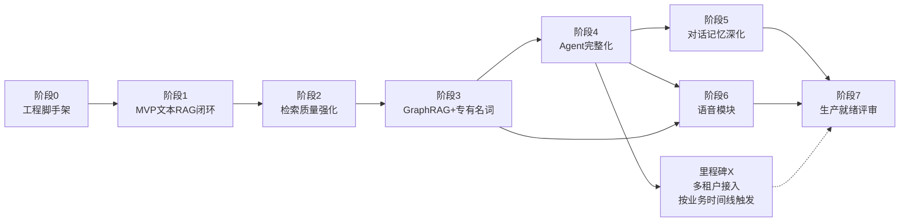

# 企业产品/SaaS客服问答机器人 — 执行计划（分阶段路线图）

> 版本：v1.0（2026-08-04）
> 依据：`docs/ARCHITECTURE.md`（架构设计方案 v1.0，章节引用均指该文档）
> 定位：项目级分阶段路线图，用于拉齐团队认知、排期和验收，不是代码级实施步骤。如需把某一阶段拆成具体可开发的 issue，建议在该阶段启动前单独用 `/to-issues` 对该阶段做二次分解。

---

## 1. 路线图总览

阶段划分遵循一个原则：**先打通风险最高、验证价值最大的闭环，再逐层叠加复杂能力**，而不是按架构文档的章节顺序照搬。每个阶段结束都应产出可独立验证的成果，而不是半成品。

阶段5（对话记忆深化）与阶段6（语音模块）互相独立，可并行推进；多租户隔离不绑定在固定阶段序号上，而是挂在"何时要接入第二个客户/产品线"这个业务事件上触发（见第4节）。

| 阶段 | 目标 | 对应架构章节 | 相对工作量 |
|---|---|---|---|
| 0 | 工程脚手架与评测框架 | 第1、10、11节 | M |
| 1 | MVP 纯文本 RAG 问答闭环 | 第1节(部分)、第5节(基础) | M |
| 2 | 检索质量强化 | 第5节(完整，含Query改写/RRF/Rerank) | M |
| 3 | GraphRAG 与专有名词准确性 | 第4节 | L |
| 4 | Agent 推理完整化 | 第3节 | M |
| 5 | 对话记忆深化 | 第6节 | L |
| 6 | 语音模块 | 第7节 | L |
| 7 | 生产就绪评审 | 第9、10、11节 | S |
| 里程碑X | 多租户接入 | 第9节 | M（触发式，非固定序号） |

> 相对工作量用 S/M/L/XL 而非具体人天——具体工期取决于团队规模和既有基础设施成熟度，本文不做没有依据的估算。若需要，可在确定团队配置后另行排期。

---

## 2. 阶段详情

### 阶段 0：工程脚手架与评测框架

**为什么排第一**：评测体系（第10节 RAGAS 评测集）如果留到后面才搭，前面几个阶段就没有客观的"做得好不好"的依据，只能凭感觉验收。评测框架必须与功能同步起步。

**范围**：
- FastAPI 项目骨架、Docker Compose 编排（Milvus/Neo4j/Redis 容器）；
- Provider 抽象层（LLM/Embedding/未来的 ASR/TTS 统一走同一套注册-分发模式，参考本地项目 eukka 的 provider registry 模式）；
- 基础输入/输出安全层骨架（规则级 PII/敏感词过滤，先上最小可用版本，不是完整版）——**安全层是贯穿全程的关注点，不应该拖到最后阶段才补**，此处只要求骨架能跑通，后续阶段逐步加强；
- 评测集雏形：先收集 30-50 条种子问答（问题-标准答案-标准引用来源），接入 RAGAS 基础指标计算脚本；
- CI 流水线：代码检查 + 评测集回归跑通。

**交付物**：一个能启动的空壳服务（返回固定回复即可），评测脚本能对种子集跑出基线分数。

**验收标准**：CI 绿灯；`docker-compose up` 一键拉起全部依赖服务。

**风险/前置依赖**：
- 需要国产云 API（LLM/Embedding）的账号和 API Key 已开通，这是纯商务/账号申请工作，不要等到开发时才发起申请。

---

### 阶段 1：MVP 纯文本 RAG 问答闭环

**为什么这么切**：先不做 GraphRAG、不做多步 Agent 推理、不做混合检索，只打通"文档进来→能问出答案"这一条最短路径，尽早验证摄取和检索的基础设施是否可用。

**范围**（对应架构文档第1节部分内容、第5节的基础形态）：
- 摄取：先支持 1-2 种最常见文档格式（如 Markdown/PDF），结构感知分块 + parent-child 检索先实现单层版本；
- 检索：单路语义向量检索（不含 BM25/RRF/Rerank/Query改写，留到阶段2）；
- 问答：单轮同步问答接口（暂不要求 SSE 流式，流式留到阶段4 Agent 完整化时一起做）；
- 使用一批真实业务文档（建议 100-300 篇代表性文档）灌入，而不是玩具数据。

**交付物**：能对种子文档回答基础问题的可用接口。

**验收标准**：阶段0评测集上的 Context Recall 基线分数产出并留档，作为后续阶段对比基准。

**风险**：
- 若首批业务文档格式比预期更混乱（大量扫描件/无结构纯文本），OCR 和解析器的工作量会显著超出本阶段预留的范围，需要提前抽样评估文档质量。

---

### 阶段 2：检索质量强化

**范围**（对应架构文档第5节完整设计）：
- 引入 BM25 关键词检索，与向量检索并行；
- 引入 RRF 融合排序，替代阶段1的简单截断逻辑；
- 引入 cross-encoder Rerank；
- 引入 LLM Query 改写（指代补全+术语归一化）——注意此时术语表可能还未在阶段3完全建好，可以先用一份最小可用的术语表雏形；
- HyDE 作为可选项先不实现，等本阶段其余能力上线并跑出评测数据后，再单独评估是否值得加。

**交付物**：检索层从"能用"升级到"跟阶段1基线相比有可衡量提升"。

**验收标准**：评测集上 Context Recall / Faithfulness 相对阶段1基线有正向提升，且没有引入新的延迟问题（检索环节耗时纳入监控）。

**依赖**：阶段1的检索管线骨架。

---

### 阶段 3：GraphRAG 与专有名词准确性

**为什么工作量标 L**：这是全架构里唯一同时涉及**工程开发**和**跨职能协作**的阶段——人工术语表的初始录入（错误码、模块名、别名对照）需要业务/产品/技术支持团队参与，不是纯研发能独立完成的任务，必须提前排期、不能假设"开发同时顺手就做了"。

**范围**（对应架构文档第4节）：
- **前置条件（非工程任务，需提前启动）**：与产品/技术支持团队协作，产出第一版术语表（标准名称+别名+类型+所属产品线），这项工作可以和阶段0-2并行启动，越早开始越好；
- Neo4j 部署与图谱 schema 设计；
- LLM 抽取 + 术语表归一化双轨制实现；
- Agent 状态图里的 TermGuard 强制安全网节点（此时才需要引入 LangGraph，因为 TermGuard 依赖图查询工具）；
- 术语准确率专项评测集（区别于阶段0的通用问答评测集，需要专门覆盖易混淆的同音/形近专有名词）。

**交付物**：图谱可查询，TermGuard 能在术语命中时强制注入图谱上下文。

**验收标准**：术语准确率评测集通过率达标（具体阈值建议在评测集建成后与业务方共同定义，本文不预设一个没有数据支撑的数字）。

**风险**：
- 术语表覆盖不全会直接拖累本阶段和后续阶段（语音模块的 ASR 校正依赖同一份术语表）的验收效果，建议把术语表维护做成一个持续性任务而非一次性交付。

---

### 阶段 4：Agent 推理完整化

**范围**（对应架构文档第3节）：
- LangGraph 状态图完整实现：Planner 多轮工具调用（vector_search_tool / graph_query_tool）、置信度评估、Fallback 转人工节点；
- `create_ticket_tool`（mock 实现，预留真实工单系统对接接口）；
- SSE 流式输出接入服务层；
- LangSmith 类 tracing 接入，作为本阶段起就应具备的可观测性能力（不要等到阶段7才补）。

**交付物**：完整的多步推理问答闭环，具备可观测的调用链路。

**验收标准**：Fallback 触发准确率（不该触发时不触发、该触发时能触发）在评测集上达到可接受水平；多轮工具调用不出现死循环（有最大迭代次数保护）。

**依赖**：阶段2检索层 + 阶段3的图查询工具就绪。

---

### 阶段 5：对话记忆深化

**范围**（对应架构文档第6节）：
- 分层记忆模型（会话滑窗+摘要 / 长期结构化记忆）；
- Mem0 风格事实抽取 → 冲突决策 → 异步 consolidation 队列；
- 多源召回融合（结构化时间检索+语义+长期记忆+BM25）+ MMR 去重；
- 时间/指代解析与澄清状态机；
- 主动性引擎（工单跟进、故障修复告知）+ 频率治理策略；
- **新增基础设施**：本阶段需要引入一个轻量关系库（PostgreSQL/SQLite）存放 `memory_items`/`memory_history`/`consolidation_jobs` 等结构化表，这是阶段0脚手架里没有预留的新组件，需要提前在阶段0或本阶段开始时补充部署。

**交付物**：客户跨会话的历史事实能被记住、更新、纠错；具备主动跟进能力。

**验收标准**：记忆冲突决策（ADD/UPDATE/DELETE/NONE）在评测场景下判断合理；主动跟进的频率治理策略在测试账号上不出现"打扰过度"的情况。

**依赖**：阶段4 Agent 骨架就位（需要在 Agent 状态里注入记忆上下文）。可与阶段6并行。

---

### 阶段 6：语音模块

**范围**（对应架构文档第7节）：
- WebSocket 流式 ASR 接入 + 全量二次识别；
- ASR 专有名词校正（复用阶段3的术语表——这是本阶段对阶段3的强依赖，术语表质量直接决定校正效果）；
- 句子级流式 TTS（首包延迟为硬性指标）：Provider 选型必须落在"流式合成"产品线，不能直接复用批量 TTS 接口；
- 分句轻量安全检查 + 异步完整审查（第9节输出安全层的拆分实现）。

**交付物**：客户可用语音提问并获得低首包延迟的语音回复。

**验收标准**：首包延迟指标达到与业务方约定的具体数值（本文不预设该数值，需在本阶段启动前与提出该硬性要求的一方明确具体毫秒级目标，否则无法验收）；ASR 转写准确率、专有名词校正命中率有专项评测数据。

**依赖**：阶段3术语表 + 阶段4 Agent（语音走同一条推理链路）。可与阶段5并行。

**风险**：
- 流式 TTS 对 provider 有额外要求，若当前签约的国产云供应商的流式合成产品线评测后达不到延迟指标，需要提前预留备选供应商调研时间，不要等到本阶段中期才发现选型不满足要求。

---

### 阶段 7：生产就绪评审

**范围**（对应架构文档第9、10、11节里此前未收尾的部分）：
- 输出安全层从"骨架"升级到完整版本（语义级审查，非仅规则匹配）；
- 评估体系形成完整 CI 闭环：所有专项评测集（通用问答/术语准确率/语音）统一接入发布门禁；
- 灰度发布策略、监控告警阈值确定；
- 上线前的整体演练（含 Fallback 转人工路径的真实演练，不能只在测试环境里跑通）。

**交付物**：可对真实客户开放的第一个正式版本。

**验收标准**：所有专项评测集在 CI 门禁下全部通过；灰度期间无 P0/P1 级问题。

---

## 3. 里程碑 X：多租户接入（触发式，非固定阶段序号）

架构文档第9节的多租户隔离设计**不绑定在固定的阶段序号上**，而是由业务事件触发：当确定要接入第二个客户/产品线时启动。

**当前状态（已启动，非空白）**：
- ✅ Milvus：单 collection + `tenant_id` 标量字段过滤（非 collection/partition 级隔离），`VectorRecord`/`VectorStore.search()` 强制要求 `tenant_id`。
- ✅ BM25Index：`search()` 按 `tenant_id` 过滤，IDF/avgdl 只在租户子集内计算。
- ✅ hybrid_search / answer_question / Agent State / `/qa` `/agent/chat`：`tenant_id` 全链路必填，缺失即报错而非静默降级。
- ✅ 记忆模块（SQLite）：`conversation_turns`/`memory_items`/`memory_history` 均加 `tenant_id` 列并按其过滤。
- ✅ 摄取流水线：`ingest_directory` 等要求 `tenant_id`，每条写入记录打标签。
- ✅ 评测框架：`run_eval_suite`/CLI 要求 `tenant_id`。

**尚未做的（明确列出，不要误认为已完成）**：
- ❌ Neo4j 节点/关系尚未打 `tenant_id`，图谱查询目前不区分租户（`Term.product_line` 字段存在但未接入过滤逻辑）。
- ❌ `tenant_id` 目前直接来自 API 请求体（客户端自报），尚未接入认证层（网关/JWT）强制注入——业务代码目前是可以被绕过的，生产上线前必须补上。
- ❌ Milvus 的 `tenant_id` 是 dynamic field 不是带索引的标量字段，租户/数据量大了会退化成全表扫描再过滤（见 `collection_init.py` 内注释）。

**为什么不预先固定顺序**：如果第一个客户上线后短期内没有第二个客户接入计划，提前做多租户隔离是过度工程；但一旦有明确的第二客户时间线，上面"尚未做的"三项必须在其上线前补齐。

---

## 4. 贯穿全程的关注点（不是某个阶段，而是持续加强）

| 关注点 | 阶段0起点 | 后续加强节点 |
|---|---|---|
| 输入/输出安全层 | 规则级骨架 | 阶段6（分句轻量检查拆分）、阶段7（完整语义审查） |
| 可观测性（tracing/监控） | 无 | 阶段4（LangSmith类tracing接入）、阶段7（告警阈值） |
| 评测体系 | 通用问答基线 | 阶段3（术语准确率专项）、阶段6（语音专项） |
| 术语表维护 | 阶段3前置启动 | 持续性任务，不因阶段3结束而终止 |

---

## 5. 关键跨职能依赖清单

以下事项不是纯研发工作，需要提前协调，避免成为阻塞：

1. 国产云 API（LLM/Embedding/ASR/TTS）账号与计费开通 —— 阶段0前完成；
2. 术语表首版内容产出（业务/技术支持团队参与）—— 阶段3前启动，越早越好；
3. 首批业务文档的格式质量抽样评估 —— 阶段1前完成，避免阶段1中期才发现 OCR 工作量超预期；
4. 语音首包延迟的具体毫秒级 SLA 数值确认 —— 阶段6启动前必须明确，否则该阶段无法定义验收标准；
5. 工单系统真实对接（阶段4的 `create_ticket_tool` 目前是 mock）—— 何时从 mock 切换到真实系统，需要与客服工单系统负责方另行排期，不在本执行计划范围内。

---

## 6. 后续建议

- 每个阶段启动前，建议用 `/to-issues` 把该阶段拆解成具体的可开发 issue（本文档的粒度是路线图，不是任务清单）。
- 若某个阶段（如阶段3 GraphRAG 或阶段6 语音模块）需要更细的代码级实施步骤，可以针对该阶段单独发起一次 `superpowers:writing-plans`，产出该子系统的 TDD 级实施计划。
